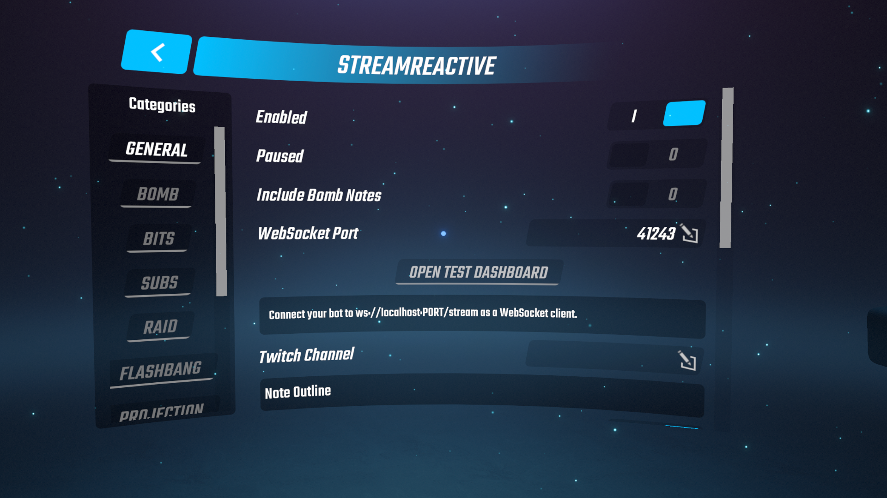
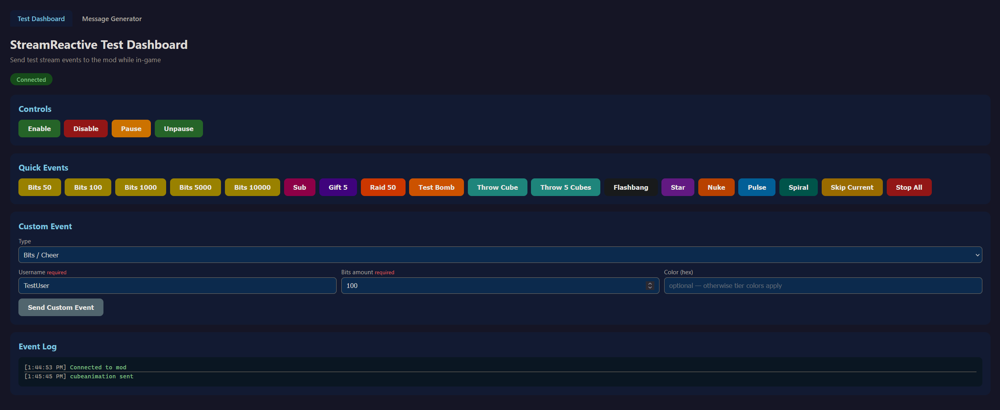
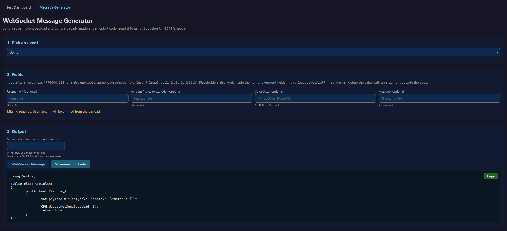

# StreamReactive
A Beat Saber mod that _Reacts_ to _Stream_ events. Simple, right?

This mod opens a websocket from your game, which you can then connect to with any bot of your choosing (NoBot, Streamer.Bot, Firebot, etc) and send events to your game based on your own rules.
You set the triggers, you set the cooldowns, or make everything trigger at once for every chat message, I won't stop you.
If anyone remembers that old GameChanger mod that was available through LIV, this is meant to be close to that idea. But completely open to use and with more features.
No invite system, nothing payed, do whatever you want if the mod lets you.
> ⚠ Before you continue: Unfortunately this mod is entirely vibe-coded. But this does not mean things go untested. If you are ok with that, carry on. ⚠

> Please explore all the settings and tabs at your own pace. See what you can tinker with to your liking.

https://github.com/user-attachments/assets/cd5c7892-b528-410d-9deb-12894a8e1f4d

# Features:
### Current implemented features:
- `Bomb` - it replaces  one of your notes with a colored bomb. Displaying a user's name or name + text + particles.
- `Bits` - Meant to trigger on bits received, all tiers supported (<100, ≥100, ≥1000, ≥5000, ≥10000). Particles + username.
- `Sub` - Shows who subscribed and for how long along with trailing effects. Supports gifting as well, showing who and how many gifts.
- `Raid` - Shows who raided and how many viewers. Similar to bits and sub events.
- `Throw` - A neat throw system. Currently supporting a player's notes (and emotes if enabled). Launches a cube that bounces off your headset/avatar.
- `Flashbang` - Streamer gets blinded by a white screen while stream/viewers gets an informative text.
- `Projection` - Sort of experimental feature I'm not sure how take advantage of yet. But it allows you to load any .obj file you want as particles. And some preset animations.
- `CubeAnimation` - Silly addition, currently only has a cube floating to the platform, lurking for a few seconds and going away. Along with a name tag.
- Management events:
 - `Enable` - Enables the mod.
 - `Disable` - Shuts down the mod basically. No reactions to anything, nothing queues up.
 - `Pause` - Similar to disable. Stops the mod from reacting to events, but does track/queue _most_ events that queue up.
 - `Unpause` - Makes the mod listen again, and play any events that may be in queue.
 - `stop_all` - Stops and clears all currently running/queued StreamReactive events.
 - `skip` - Skips the currently playing event and makes the next one in queue start.
- Map protection system. Automatically pause events based on:
  - Noodle maps
  - Vivify maps
  - WIP maps (loaded from your wip folder)
  - Ranked maps (BeatLeader and ScoreSaber)
- If you provide your twitch channel name in the general tab:
  - Chat: A simple and customizable panel that displays your twitch chat.
  - Emotes: Supporting Twitch, BTTV, FFZ and 7tv. Displayed as emote rain or using the throw system.
- Pretty much everything configurable from inside the game with the ability to override some things via websocket.
- In-game you can also launch a [test dashboard](#test-dashboard) that opens in your browser. Here you can test things and see how they look.
- The [test dashboard](#test-dashboard) also includes a [message generator](#message-generator) for easy setup of all the supported events (json string or ready made streamer.bot c# code).
# Installing/Setting Up
### Dependencies:
- Your usual core mods: `BSIPA`, `SongCore`, `BS Utils`, `BSML`
- `websocket-sharp`
- `SongDetailsCache`
### Adding the mod:
- Just like any other mod, head over to the [releases page](https://github.com/FEFELAND/StreamReactive/releases) and grab the latest release.
- Drag StreamReactive.dll and place it in your Plugins folder
- Upon first launch, a config file and a `StreamReactive` folder will show in your `UserData` folder. [Explained here](#userdata-folders)
### Basic setup:
- In your preferred stream bot, connect to the following socket client: `ws://localhost:41243/stream` (or whatever port you set)
- Using the [message generator](#message-generator) in the [test dashboard](#test-dashboard) configure any events you want to trigger into your bot.
- Pretty much on your own from there/unique to what bot you are using and how you want to trigger events. Chanel points, commands or anything else you think of.
## Test Dashboard and Generator
The following pages you can find by clicking "open test dashboard" in-game or by going to http://localhost:41243/ (or your port) while the game is open.
### Test Dashboard
> The test dashboard `quick events` work without any bot setup at all. Just to see if the events respond in your game and such.

### Message Generator
> You can use this tab to quickly setup the messages/strings you need your bot to send in order to get events to start showing. Currently can be generated as a regular json or ready made C# code for streamer.bot

## UserData Folders
Currently you can find `Sounds` and `Projections` in there.

### Sounds
- In this folder, throw any `.ogg` files you'd like. In-game you have the option to select those sounds from a list in several of the events.
### Projections
- In this folder, throw any `.obj` files you'd like. Models. The main idea behind this was: The old GameChanger plugin had a phoenix that would spawn at the 10,000 bits tier animation. With this you could have that with a phoenix like logo, your own logo or whatever you want to put there.

## Queue System

Some of the events will queue up and some of the events play exactly at the time of request.

### Queued events:
These events will wait in line and play in the order the mod receives them.
- Bits, Subs, Raids, Bombs. Bombs are special: if a bomb hasn't been cleared before the next event in line and a new bomb arrives, that new request joins the current bomb event.
### Events that work at any time:
These will play exactly at the time of request. Even if there are bits or subs or any queued event running.
- Throw, Flashbang, Projections, Cube Animations (`Lurk` currently)

## Menu vs In-game
- Pretty much every event works while you are inside a song/map.
- The menu has a few events that work: Throw, Flashbang, Projections, Cube Animations (`Lurk` currently)

### Extra note:
Oh by the way. If you use "throw" or the "lurk" before ever starting a map first, you will likely see a placeholder cube. Once you enter a map, see notes for the first time and leave, then it will show correctly.
